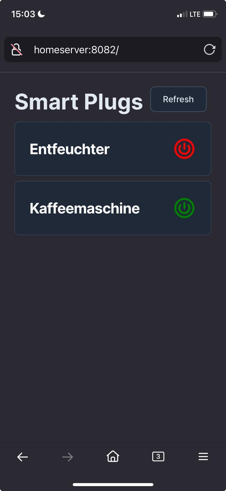

# smart_plugs

This repository will be a webservice that host a simple website to turn on and off smart devices in the local network using the [tinytuya](https://github.com/jasonacox/tinytuya) library

## Requirements

- Python 3.10+
- Cheap chinese SmatHome-Devices ([my plugs](https://www.amazon.de/Usmart-Steckdose-Smart-WLAN-Sprachsteuerung/dp/B09J8P9YFL/ref=sr_1_6?__mk_de_DE=%C3%85M%C3%85%C5%BD%C3%95%C3%91&crid=W27SLGI75J8Y&dib=eyJ2IjoiMSJ9.NcGiVPdTaerstlacjnw_hXRZqkonT1cFxPHMoGu4lgvIXfD3OuNyJddWNR7hvBAD4HhFaSuuVeg41SpwV8y-JOB6kAUGRUtOGvAif2m8rGclMe3bAUM9F7s5ua_hOapD8TbWr6F5asidif8_odmHPiLCvSIvA16ZsqnGwr2JKpksRYCeFovixelLg60FfufRl7RhpLEH0uNQEFOlt8iwIZbWQgJMLtH1MhB9uaLggKHdrpoggfCS6WV0F0dlo9008L9HKCfXJ2IgqxL5gBx2Y1EhJATcPX-2boNK1Qvw26Y.DashDJ6SAQGDH1OOA0YQM4G0hS0byhohRMn2-9N1_qk&dib_tag=se&keywords=gosund+plug&qid=1711358532&sprefix=gosund+plug%2Caps%2C89&sr=8-6))
- Mostly setup my deivces using [tinytuya wizzard](https://github.com/jasonacox/tinytuya?tab=readme-ov-file#setup-wizard---getting-local-keys)

## Adding new devices

1. `pip install -r requirements.txt`
2. Pair the device with the "Tuya Smart" mobile app
3. Run `python -m tinytuya wizard` to get the device id and local key
   1. Once the local_key and device_id are fetched from the tuya app, the app is no longer needed, unless the devices get paired anew
   2. After setup the devices using the tuya app, the internet access from the devices can be disabled in the router settings

4. Assign a fixxed ip4-address for the device
